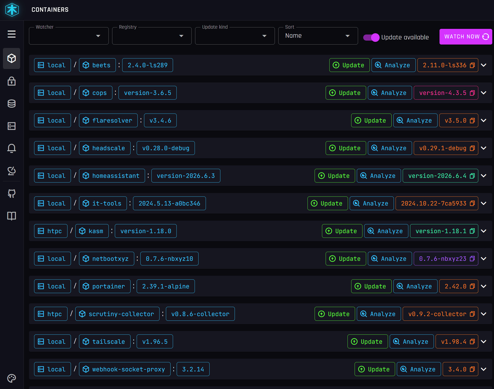

# Hosaka

<p align="center">
  
</p>

[](https://github.com/nopoz/hosaka/actions/workflows/ci.yml)
[](https://github.com/nopoz/hosaka/releases)
[](https://github.com/nopoz/hosaka/pkgs/container/hosaka)
[](LICENSE)

Hosaka watches your Docker hosts for new container image versions, then lets you
react: get notified, or update the container with a single click and watch the
update run live.

Hosaka is a fork of [What's Up Docker (WUD)](https://github.com/getwud/wud),
rebuilt around a faster, mobile-friendly UI and one-click updates.

<p align="center">
  
</p>

## Table of Contents

- [Why Hosaka](#why-hosaka)
- [What's different from WUD](#whats-different-from-wud)
- [How it works](#how-it-works)
- [Features](#features)
- [Get started](#get-started)
- [Documentation](#documentation)
- [Works with](#works-with)
- [Security](#security)
- [More of my projects](#more-of-my-projects)

## Why Hosaka

Keeping self-hosted containers up to date is a chore with bad default options.
Pin everything to `latest` and updates land silently: you do not know what
version is running, a pull can break a service overnight, and there is no clean
way back. Pin explicit versions instead and you trade surprises for manual toil:
watching release notes, hunting for new tags, and editing compose files by hand
across every host. Blind auto-updaters take the wheel entirely, which is the last
thing you want for a database or a service you depend on.

Hosaka sits in the middle, where most people actually want to be:

- **Know what is running.** Keep pinned versions in your stacks and let Hosaka
  watch your registries, so a new release shows up in one place instead of you
  going to look for it. A `hosaka.link.template` label turns each update into a
  direct link to that version's release notes, so you can read what changed
  without hunting down the changelog.
- **Update on your terms.** Nothing changes until you click. Every update is
  classified as major, minor, patch, or prerelease, so you can take a patch and
  hold back a major.
- **See it happen.** Updates are not a black box: the run streams to the UI line
  by line and waits for the container to come back healthy before it counts as
  done.
- **Stay in control of Portainer stacks.** The built-in updater rewrites the
  stack file from the current pinned version to the new one and redeploys through
  the API, so your stack definition stays the source of truth and rolling back is
  just redeploying the old tag.
- **Cover every host, from your phone.** Watch local and remote Docker hosts at
  once, and drive it all from a responsive UI that works on mobile.

## What's different from WUD

| Area | WUD | Hosaka |
|------|-----|--------|
| **Updating from the UI** | run a trigger from the container's Triggers tab | one-click **Update** on the container row |
| **Update progress** | none | live console output of the update, streamed line by line |
| **Portainer stacks** | generic script trigger, write your own | built-in one-click updater that rewrites the stack file and redeploys through the Portainer API |
| **Mobile** | desktop-oriented: permanent nav, no mobile layout | fully responsive: hamburger nav, mobile layouts, update from your phone |
| **Live container state** | manual refresh | list updates in place over SSE, no full-page reload |
| **Update lifecycle** | trigger fires; output is logged server-side after it exits | tracks the container recreation, confirms the new container is live, and carries the "update complete" state onto the new container ID |
| **In-app UX** | filter + oldest-first toggle | sort by name, update type, or watcher; distinct color per update type, including prerelease |
| **Theming** | single look, dark/light toggle | five built-in themes via an in-app picker, on a distinct cyberpunk identity |

## How it works

Hosaka is a pipeline built from three kinds of components. **Watchers** find the
containers you care about, **registries** tell Hosaka what newer images exist,
and **triggers** act on what is found.

- **Watchers** connect to your Docker hosts, local socket or remote over TCP/TLS,
  and list the running containers. You decide what is watched with a
  `hosaka.watch` label or a watch-by-default setting, so Hosaka only tracks what
  you opt in to.
- **Registries** are the upstream sources Hosaka queries for available tags:
  Docker Hub, GHCR, ECR, GCR, Quay, and the rest. For each watched container it
  picks the registry the image came from and asks what tags exist.
- **Triggers** are the actions that run when an update is available: send a
  notification, update a Docker container or compose stack, or run an update
  script such as the built-in Portainer updater.

### The watch cycle

Each watcher runs on a cron schedule and also reacts to Docker events as
containers start and stop. Every cycle it:

1. Lists the running containers and keeps the ones you have opted in to watch.
2. Parses each container's image into comparable parts: name, tag, and digest.
3. Asks the matching registry for the available tags, then narrows them to real
   candidates. It applies your include/exclude regex and any tag transform, then
   compares with semver to find versions newer than the one running. For mutable
   tags like `latest`, it compares the image digest instead of the tag.
4. When a newer version or a changed digest is found, it builds an update report,
   classifies the change as major, minor, patch, or prerelease, and records it.

Every report is emitted as an event. Triggers subscribe to those events and
decide whether to act based on your rules: only on certain update types
(thresholds), only once per version, notify versus update. Notifications go out
right away; an update waits for you to click it, or runs on its own if you
configured it to.

### When an update runs

Updating recreates the container on the new image, which gives it a new container
ID. Hosaka follows that swap: it confirms the new container is running, forces an
immediate rescan so the list reflects reality, and carries the update state onto
the new container instead of leaving a stale or orphaned row. While the update
runs, the script's output streams to the UI line by line, and the run is not
marked done until the new container comes back healthy.

## Features

**Smart update detection**
- Watch multiple Docker hosts at once, local socket or remote over TCP/TLS
- Semver-aware: every update is classified as major, minor, patch, or prerelease
- Digest watching catches new images behind mutable tags like `latest`
- Per-tag include/exclude regex and tag transforms to handle any versioning scheme
- Scheduled (cron) scans plus instant detection from Docker events

**Per-container control, no central config**
- Drive everything with `hosaka.*` Docker labels: opt in/out, set tag filters,
  custom display name and icon, or a link to the release notes
- Update thresholds so you only act on, say, minor and patch bumps

**Notify or update, your call**
- Notify through SMTP, Slack, Discord, Telegram, Apprise, IFTTT, Pushover,
  Kafka, MQTT, or HTTP webhooks, with templated titles and bodies
- Auto-update Docker containers and docker-compose stacks, or run your own
  update script, automatically or with a single click from the UI
- Per-update or batched notifications, with a "once" guard against repeats

**Updates that keep track of themselves**
- An update recreates the container under a new ID; Hosaka detects the swap,
  confirms the new container is running, forces an immediate rescan, and carries
  the "update complete" status onto the new row, so the UI reflects reality
  instead of a stale or orphaned entry
- The live state stream pushes only real changes, so dozens of containers can
  update in place without flooding or freezing the page
- State is flushed on shutdown, so the last writes survive a restart

**One-click Portainer stack updates, built in**
- Ships a ready-to-use updater for Portainer-managed stacks: it rewrites the
  stack's compose file to the new image tag and redeploys through the Portainer
  API, so your stack definition stays the source of truth
- Built around pinned versions: keep explicit image tags in your stack instead of
  `latest`, and step from one known version to the next when you choose, so you
  always know what is running and can roll back by redeploying the old tag
- Nothing to write or mount; point it at your Portainer URL and API key and the
  Update button does the rest. Connecting over HTTPS to a self-signed certificate
  (or by IP) works too, by opting in with `PORTAINER_INSECURE=true`
- Health-aware progress: the run streams to the UI line by line and waits for the
  container to come back healthy on the new image before reporting success
- Reference stack in [`docker-compose.example.yml`](docker-compose.example.yml);
  details in the [Portainer update script docs](https://nopoz.github.io/hosaka/#/configuration/triggers/script/portainer)

**Built to run in your stack**
- Web UI and a full REST API
- Prometheus metrics and a `/health` endpoint, ready for Grafana
- Basic auth or OpenID Connect (OIDC) for SSO
- Docker secrets via `__FILE` env vars, single image, sensible defaults

## Get started

Create a `docker-compose.yml`:

```yaml
services:
  hosaka:
    image: ghcr.io/nopoz/hosaka:latest
    container_name: hosaka
    restart: unless-stopped
    volumes:
      - /var/run/docker.sock:/var/run/docker.sock
      - ./store:/store
    ports:
      - 3000:3000
```

Then bring it up and open the UI:

```bash
docker compose up -d
```

The UI is now at [http://localhost:3000](http://localhost:3000).

For a hardened setup (read-only Docker socket proxy, plus watcher, registry, and
trigger config), copy [`docker-compose.example.yml`](docker-compose.example.yml)
and adjust it. Full configuration reference lives in the
[documentation](https://nopoz.github.io/hosaka/).

## Documentation

Full docs are published at **[nopoz.github.io/hosaka](https://nopoz.github.io/hosaka/)**.

- [Quick start](https://nopoz.github.io/hosaka/#/quickstart/)
- [How it works](https://nopoz.github.io/hosaka/#/how-it-works/)
- [Configuration](https://nopoz.github.io/hosaka/#/configuration/)
  - [Watchers](https://nopoz.github.io/hosaka/#/configuration/watchers/)
  - [Registries](https://nopoz.github.io/hosaka/#/configuration/registries/)
  - [Triggers](https://nopoz.github.io/hosaka/#/configuration/triggers/)
  - [Authentication](https://nopoz.github.io/hosaka/#/configuration/authentications/)
- [UI](https://nopoz.github.io/hosaka/#/ui/)
- [REST API](https://nopoz.github.io/hosaka/#/api/)
- [Monitoring](https://nopoz.github.io/hosaka/#/monitoring/)

## Works with

Quick reference for what Hosaka plugs into. Full setup lives in the
[documentation](https://nopoz.github.io/hosaka/).

**Registries:** Docker Hub, GitHub (GHCR), GitLab, Gitea, Forgejo, AWS ECR,
Azure ACR, Google GCR, LinuxServer (lscr.io), Red Hat Quay, and any self-hosted
Docker registry.

**Notifications:** SMTP, Slack, Discord, Telegram, Apprise, IFTTT, Pushover,
Kafka, MQTT, and HTTP webhooks.

**Auth / SSO:** Basic auth, or OpenID Connect (Authelia, Authentik, Auth0,
Keycloak, and other OIDC providers).

**Monitoring:** Prometheus metrics and a `/health` endpoint, ready for Grafana.

**Home:** Home-Assistant.

## Security

Hosaka talks to your Docker host and can update running services, so treat it as
a privileged tool.

- **Lock down access.** Hosaka allows anonymous access by default. Enable
  [Basic auth](https://developer.mozilla.org/en-US/docs/Web/HTTP/Authentication)
  or [OIDC](https://openid.net/connect/) before exposing it, and put it behind a
  reverse proxy with TLS rather than publishing the port to the internet. Anyone
  who can reach the UI or API can trigger updates that change your live
  containers.
- **Limit Docker access.** The Docker socket is effectively root on the host.
  Prefer the read-only socket proxy shown in `docker-compose.example.yml` over
  mounting `/var/run/docker.sock` directly, so Hosaka only gets the endpoints it
  needs.
- **Keep secrets out of plain config.** Registry credentials and trigger tokens
  can be loaded from files with the `__FILE` env var suffix (Docker secrets)
  instead of being written in your compose file.

## More of my projects

Other open-source tools I maintain that you might find useful:

- [**Portrieve**](https://github.com/nopoz/portrieve) - back up, restore, and
  migrate Portainer stacks as plain Docker Compose files.
- [**pfSense DNSCrypt Proxy**](https://github.com/nopoz/pfsense-dnscrypt-proxy) -
  a pfSense package for DNSCrypt Proxy: encrypted DNS with full GUI support.

## Contact & Support
- Create a [GitHub issue](https://github.com/nopoz/hosaka/issues) for bug reports, feature requests, or questions
- Add a star on [GitHub](https://github.com/nopoz/hosaka) to support the project!

## Credits
Hosaka builds on [What's Up Docker](https://github.com/getwud/wud) by the WUD
authors and contributors. Huge thanks to them for the solid foundation this fork
is built on.

## License
This project is licensed under the [MIT license](https://github.com/nopoz/hosaka/blob/main/LICENSE).
